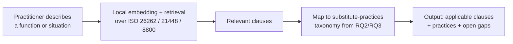
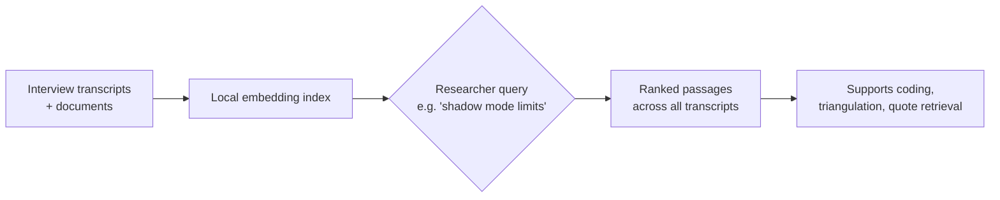
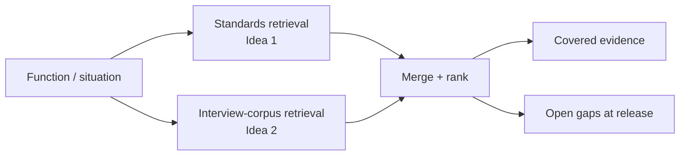

# Application Ideas — Local AI / RAG Artifact

Why: interview and internal-document access will likely be thin (~5–6 interviews, limited internal docs). A local, privacy-preserving tool turns that constraint into a documented methodological choice rather than a weakness — and gives the thesis a demonstrable artifact independent of data volume. All three ideas run on-device: automotive validation and interview data is exactly the kind of material that shouldn't be sent to a cloud API.

Recommendation: build **Idea 2** as the primary artifact. Fall back to **Idea 1** if it needs to work before interviews are done. Only attempt **Idea 3** if time remains — it's 1 + 2 combined.

---

## Idea 1 — Standards-and-Evidence RAG Assistant

Retrieves the relevant clauses from ISO 26262 / ISO 21448 (SOTIF) / ISO/PAS 8800 for a described function and maps them to the substitute-practices taxonomy from RQ2/RQ3.

**Why it fits the constraint:** runs on public standards text — needs no internal data at all, so it can be built and demoed regardless of access.

---

## Idea 2 — RAG-Supported Interview Coding (primary recommendation)

A local retrieval layer over your own interview transcripts, used during qualitative coding — semantic search across transcripts (e.g. "every mention of shadow-mode limitations") to support triangulation and rigor.

**Why it fits the constraint:** it needs a *small* corpus to be tractable, not a large one. Documented in the methods chapter as how you did rigorous analysis on a small, sensitive dataset without sending it to a cloud model — a genuine methodological contribution, not just a demo.

---

## Idea 3 — Practice-Selection Decision-Support Tool

Combines Idea 1 and Idea 2: a situation goes in, the tool retrieves both matching standards clauses and the closest matching cases from the interview corpus, and shows covered vs. open evidence gaps.

**Why it fits the constraint:** most complete demo, but doubles the retrieval sources and adds a mapping layer — most build time of the three, only worth it if 1 and 2 are already done.

